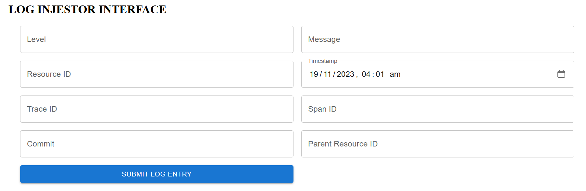

## Overview

Log Insight is a comprehensive web-based application designed to streamline the process of log data management.

# VIDEO LINK BELOW

<a href="https://www.loom.com/share/d34bde9e7f0b4852ac60886dcabd592f"><strong>Click Here</strong></a>

## Components of the project

Frontend

    Tech Stack: React, Material-UI
    Responsibilities: User interface for submitting and querying log data.

Backend

    Tech Stack: Node.js, Express, MongoDB
    Responsibilities: API endpoints for data ingestion and querying. It interacts with the MongoDB database to store and retrieve log data.

Database

    MongoDB: Stores log data. Schema includes level, message, resourceId, timestamp, traceId, spanId, commit, metadata.

## System Design Overview

1. Frontend Application

   Role: for data submission and querying.
   Technology: React.js and Material-UI.
   Features:

   Form for log data submission to the backend.
   Interface for querying logs with filters.
   Real-time display of ingested logs.
   UI elements for full-text search capabilities.

2. Backend Application

   Role: Handles HTTP requests, processes data, and interacts with the database.
   Technology: Node.js with Express.js and MongoDB(database).

   Features:

   ##### Log Data Ingestion Endpoint (/ingest):

   -> Accepts HTTP POST requests with log data.

   -> Validates and processes data before saving it to the database.

   ##### Query Endpoint (/search):

   -> Handles GET requests with various query parameters for filtering logs.

   -> Implements full-text search using regular expressions.
   (for real-time log ingestion).

   -> Updates the frontend in real-time when new logs are ingested.

## Features in the project:

#### Log Data Ingestion: Ability to ingest log data via an HTTP POST request.

#### Log Data Querying: Capability to query the ingested logs with various filters.

#### Real-Time Log Ingestion: Real-Time log injestion from frontend

#### Full-Text Search: Enhanced search functionality using regular expressions.

## BONUS FEATURES

### 1) Combine Multiple Filters

### 2) Utilize regular expressions for search.(For Message Input In Query Interface)

### 3) Provide real-time log ingestion and searching capabilities.

## HOW TO RUN

### Clone the repository

`git clone https://github.com/dyte-submissions/november-2023-hiring-Pheewww`

### Navigate to the frontend project directory

`cd Frontend` then
`cd my-react-app`

### Install dependencies

`npm install`

### start the frontend application

`npm run dev` or `npm start`

### Navigate to the backend project directory

`cd Backend`

### Install dependencies

`npm install`

### Start the backend server

`node server.js`

## Known Issues

known issues or limitations within the system.

    Load Balancing and Caching could have been implemented in backend
    Filtering with timestamp could have also ben implemented
